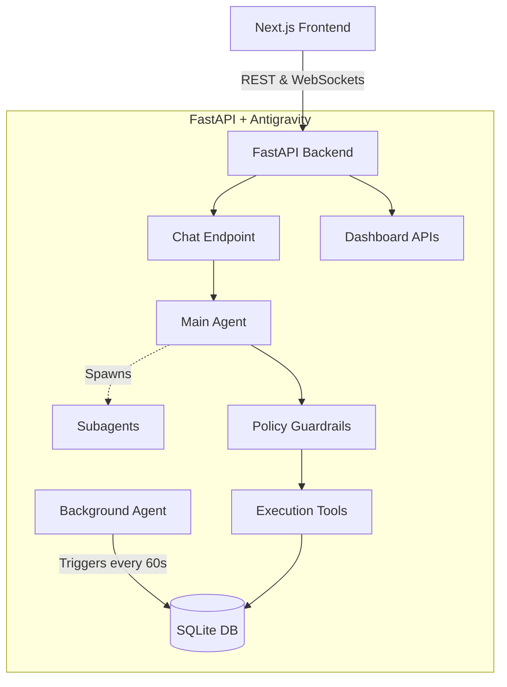

<div align="center">
  
  # 🌐 SupplySense AI
  
  **Autonomous Enterprise Supply Chain Agent**
  
  [](https://nextjs.org/)
  [](https://fastapi.tiangolo.com/)
  [](https://google.com/)
  [](https://sqlite.org/)

  <p align="center">
    SupplySense is a state-of-the-art, autonomous command center designed for global supply chain operations. It transforms passive dashboard metrics into proactive, agentic workflows using Google's Antigravity SDK.
  </p>
</div>

---

## ✨ The "Wow" Factors (Core Features)

🚀 **Proactive Anomaly Detection (Background Agent)**
SupplySense doesn't just wait for you to ask questions. A background agent wakes up every 60 seconds to scan live telemetry across global nodes. If a shipment is delayed or a stockout is imminent, it pushes a critical alert directly to your dashboard.

🧠 **Live AI Executive Summaries**
Instead of staring at complex charts, executives get a dynamic, plain-English narrative of the supply chain's health. The agent synthesizes millions of data points into a readable summary complete with a "Cost of Delay Translator" to quantify financial bleed.

🤖 **Multi-Agent Conversational Execution**
The Global Assistant features persistent memory and the ability to spawn subagents for heavy analytical lifting. It doesn't just read data—it writes it. You can ask the AI to naturally draft supplier emails or dispatch emergency purchase orders.

🛡️ **Enterprise Safety Guardrails**
Because the agent has write-access to financial systems, we implemented hard-coded safety policies. If the AI attempts to execute an order beyond strict financial thresholds (e.g., >10,000 units), the Antigravity engine instantly intercepts and blocks the transaction.

## 🏗️ Architecture

SupplySense operates on a decoupled architecture, isolating the frontend command center from the heavyweight Python AI orchestration layer.



## 🛠️ Tech Stack

* **Frontend:** Next.js (React), Vanilla CSS (Custom Design System), Lucide Icons
* **Backend:** Python, FastAPI, Uvicorn, SQLAlchemy
* **AI Orchestration:** Google Antigravity (AGY) SDK, Gemini API
* **Database:** SQLite (Easily swappable to PostgreSQL via SQLAlchemy)

## 🚦 Getting Started (Local Development)

### 1. Backend Setup (FastAPI)
Navigate to the root directory and set up the Python environment:
```bash
# Create and activate virtual environment
python3 -m venv venv
source venv/bin/activate

# Install dependencies
pip install -r requirements.txt

# Add your Gemini API Key
export GEMINI_API_KEY="your_api_key_here"

# Start the server (Initializes DB, Seeds Data, and Starts Background Agent)
bash run.sh
```
*The API will run on `http://localhost:8000`*

### 2. Frontend Setup (Next.js)
Open a new terminal and navigate to the frontend directory:
```bash
cd frontend

# Install dependencies
npm install

# Start the development server
npm run dev
```
*The dashboard will run on `http://localhost:3000`*

## 🎬 Hackathon Demo Flow
1. **The Executive Shimmer:** Open the Executive Summary tab and watch the shimmer effect as the AI builds the narrative live.
2. **The Disruption Trigger:** Click the "Trigger Disruption" button in the top bar. Wait a few seconds, and watch the background agent push a red, pulsing notification to the global header.
3. **The Safety Block:** Open the Chat Assistant and type: *"Dispatch a purchase order for 20,000 units of PROD-001"*. Watch the agent parse the trace, hit the policy guardrail, and render a rich UI card indicating the action was blocked to protect company finances.

---
*Built with ❤️ for the Hackathon.*
